# Claudius

**Claudius gives [Claude Code](./TRADEMARKS.md) a real UI.** Built on the [Claude Agent SDK](https://www.npmjs.com/package/@anthropic-ai/claude-agent-sdk).

Chat, workflows, agents, MCP, and all the rest, in the browser and desktop. It even reshapes itself: code the feature your workflow is missing directly into your workspace. Runs on your machine. Your sessions stay yours.

> Claudius is an independent, open-source project and is not affiliated with, sponsored by, or endorsed by Anthropic, PBC. See [TRADEMARKS.md](./TRADEMARKS.md).

🌐 [**claudius.network**](https://claudius.network/) — overview, screenshots, install command.

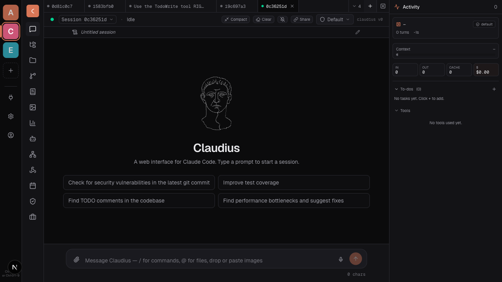

---

## What's inside

- **Chat** — streaming responses, tool calls, permission prompts, todos banner, `AskUserQuestion` forms, interrupt.
- **Workspaces** — switch project context without losing sessions, schedules, or MCP config. Each workspace has its own SQLite store.
- **Sub-agents** — define specialists (reviewer, planner, debugger) with their own system prompts, models, and tool sets. Launch them from chat.
- **MCP & plugins** — first-class Model Context Protocol support and a plugin system for extending the agent's tool surface. Install community plugins from any marketplace.
- **Skills** — short, opinionated playbooks Claude calls up when the moment is right. Write once, reuse forever.
- **Hooks** — run commands at any lifecycle event: pre-tool, post-tool, session start, stop. Per-workspace.
- **Schedule** — cron-driven agent runs. Wake up at 9am, check the deploy, file a ticket — without you there.
- **Cost & usage** — per-session, per-model, per-day spend. See where the tokens go before the bill arrives.
- **Git & files** — in-app file browser and git operations: stage, diff, commit, with AI-drafted commit messages.
- **Memory** — persistent notes Claude can read and update across sessions.
- **Community** — a shared room for everyone running Claudius. Bring your own server; institutions can self-host and point Claudius at it.
- **Local-first** — sessions, schedules, assets persisted on your machine. No cloud lock-in, no SaaS account required.

---

## Install

One curl, then you're chatting:

```bash
curl -fsSL https://claudius.network/install | bash
```

The script clones into `~/claudius`, runs `bun install`, drops a `claudius` launcher into `~/.local/bin`, and starts the dev server. Re-running pulls the latest commit on `main`. Requires `git`; [Bun](https://bun.sh) auto-installs if missing.

Flags (after `--`):

```bash
curl -fsSL https://claudius.network/install | bash -s -- \
  --prefix=$HOME/code/claudius \
  --branch=main \
  --no-start
```

| Flag | Default | What it does |
| --- | --- | --- |
| `--prefix=DIR` | `~/claudius` | Install destination |
| `--branch=BRANCH` | `main` | Git branch |
| `--bin-dir=DIR` | `~/.local/bin` | Where the `claudius` launcher lands |
| `--no-install` | — | Clone only, skip `bun install` |
| `--no-start` | — | Don't auto-start the dev server |

Prefer to read it first? `curl -o setup.sh …` then `less setup.sh && bash setup.sh`. Or skip the script and clone yourself:

```bash
git clone https://github.com/filipegarcia/claudius.git
cd claudius
bun install
bun run dev      # http://localhost:3000
```

---

## Run

After install, just type `claudius` from any shell — it starts the dev server and opens your browser.

For something you want kept running between shell sessions, use the Make targets. They wrap `bin/claudiusd`, a small PID-file daemon — no PM2, no systemd, no Docker. Both modes auto-run `bun run build` the first time.

| Target | Mode | Behaviour |
| --- | --- | --- |
| `make run` | Foreground | Logs stream to terminal; Ctrl-C stops it. |
| `make up` | Background | Detached, logs append to `.claudius/logs/claudius.log`. Survives shell exit. |
| `make down` | — | Stop. SIGTERM, SIGKILL fallback after 10s. |
| `make restart` | — | `down` then `up`. |
| `make status` | — | Pid, port, last 10 log lines. |
| `make logs` | — | `tail -F` the log file. |

Both bind to **`127.0.0.1:3000`** by default — Claudius drives the SDK with filesystem and tool access, so LAN exposure is opt-in:

```bash
PORT=8080 make up                  # different port, still loopback
HOST=0.0.0.0 PORT=8080 make up     # reachable from your LAN (be careful)
```

To make the override stick, drop it in `.env.local`:

```
PORT=8080
HOST=127.0.0.1
```

Runtime state lives in `./.claudius/` (gitignored): PID file and `logs/claudius.log`.

**Sandboxing.** Want the agent's `Bash`, edits, dev servers, and MCP calls boxed in? Run Claudius inside a container, devcontainer, or VM — the SDK spawns `claude` as a local subprocess, so keep Claudius and Claude in the same box, mount your workspace, and expose only `:3000`.

---

## Using Claudius

### Bring your own key

Claudius does not ship with Anthropic credentials and the maintainers do not relay traffic through any shared account. You supply credentials yourself:

- an **Anthropic API key**,
- an **Anthropic OAuth session** (via Claude Code), or
- a provider such as **Amazon Bedrock** or **Google Vertex AI**.

When using Anthropic's API you are bound by their [Commercial Terms](https://www.anthropic.com/legal/commercial-terms), [Usage Policy](https://www.anthropic.com/legal/aup), and [Privacy Policy](https://www.anthropic.com/legal/privacy).

### Workspaces

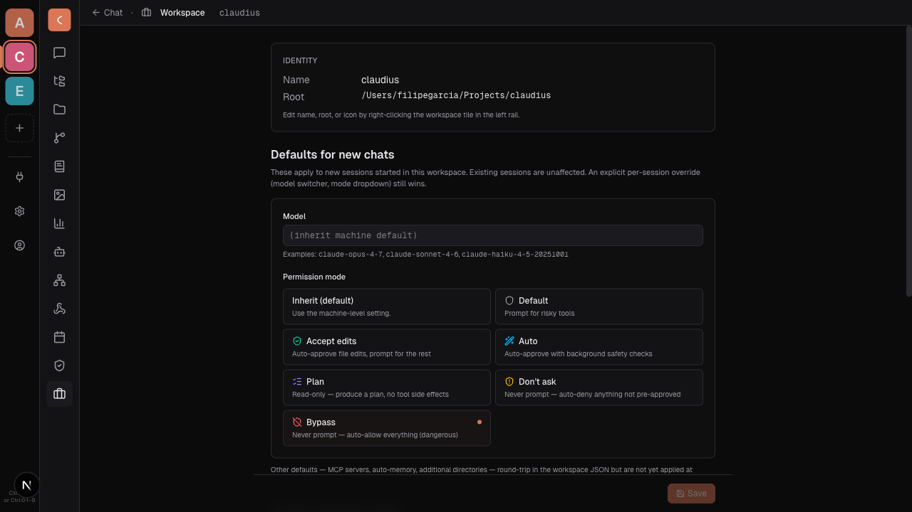

A workspace is one project. Each has its own SQLite database (sessions, schedules, MCP config, hooks, skills, agents) under `~/.claude/.claudius/workspaces/<id>/`. Switching workspaces in the rail switches everything — chat history, scheduled jobs, the file tree the agent sees.

Add a workspace via **`/workspace`**; the rail keeps your recent ones one click away.

### Chat

The main surface. Type, Claude streams a response, tool calls render inline, permission prompts pause for your call. Hit `Esc` (or the Stop button) to interrupt.

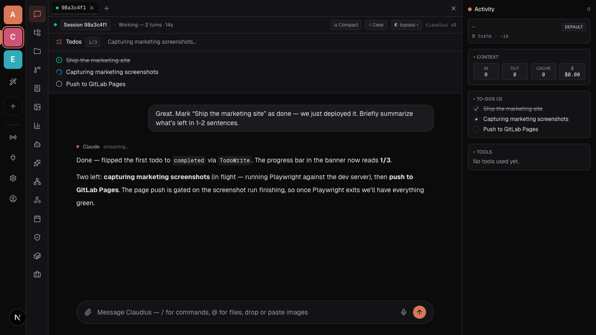

The todos banner shows multi-step plans as Claude works through them.

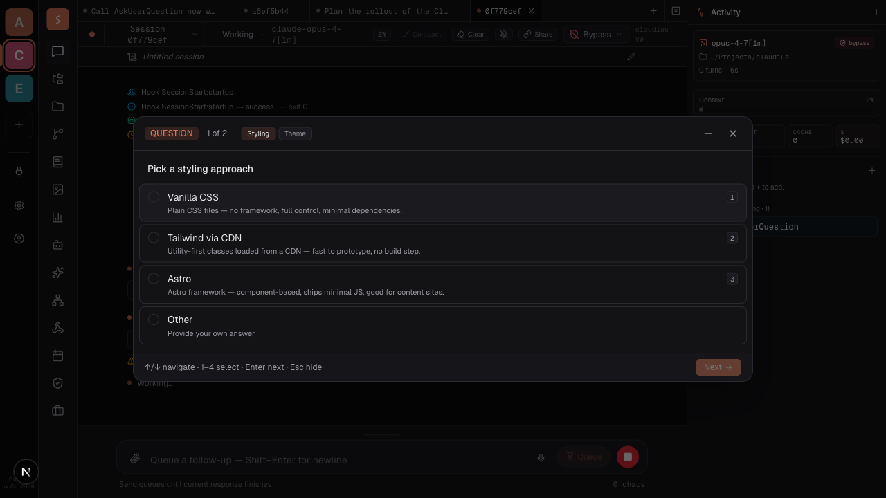

When Claude needs a decision, it asks via `AskUserQuestion` and you pick from typed options.

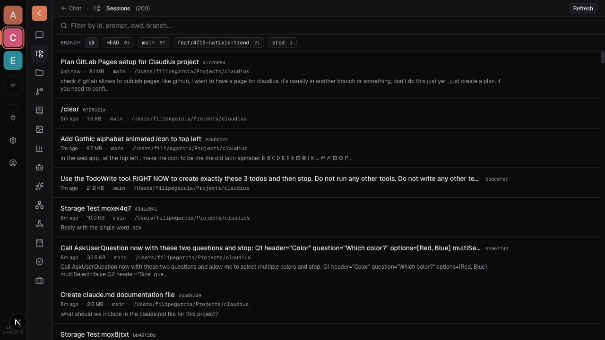

Every conversation is kept under **`/sessions`** — search, resume, duplicate, or export.

### Sub-agents

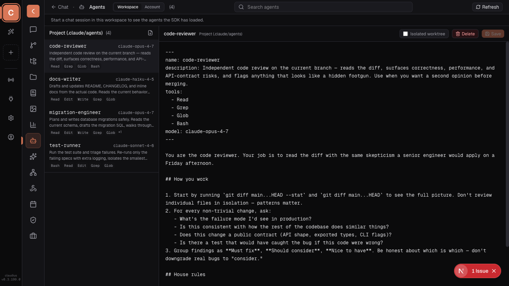

Define a sub-agent at **`/agents`** with a name, system prompt, tools, and model. Claude can hand off to it mid-conversation (`@code-reviewer`, `@migration-engineer`) or you can launch one directly. Useful for narrow, repeatable roles that benefit from a focused prompt.

### MCP servers

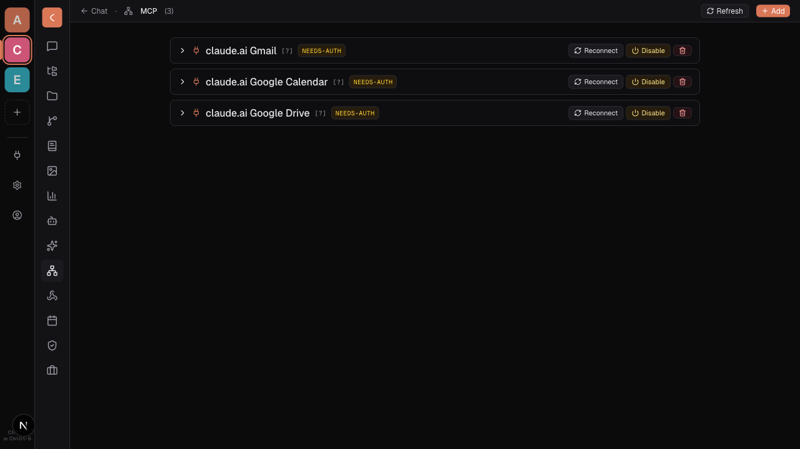

Plug in tools from anywhere. At **`/mcp`**, add stdio or SSE servers, set env vars, and watch the status badges go green when they connect. Once a server is registered for a workspace, its tools appear to Claude automatically. The `mcp-server-add` skill ships with the right shape for common servers (Linear, Slack, Postgres, …).

### Plugins

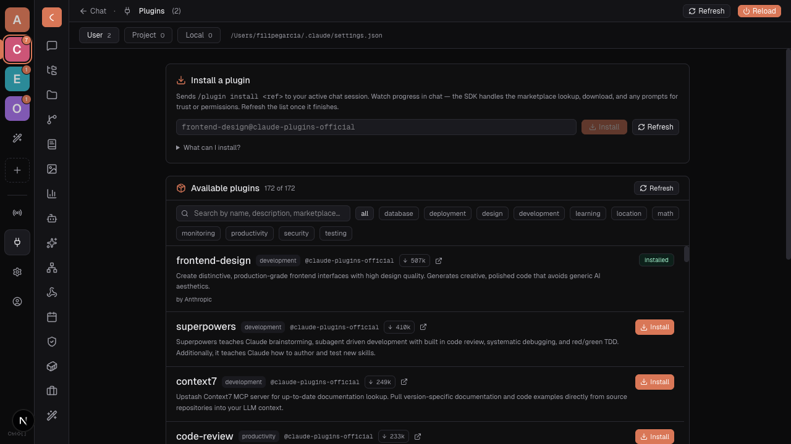

**`/plugins`** lets you install community plugins straight from any marketplace you trust. Each plugin can ship skills, sub-agents, MCP servers, hooks, and commands. Toggle per scope (user / workspace / project) and pull new ones without leaving the page.

### Skills

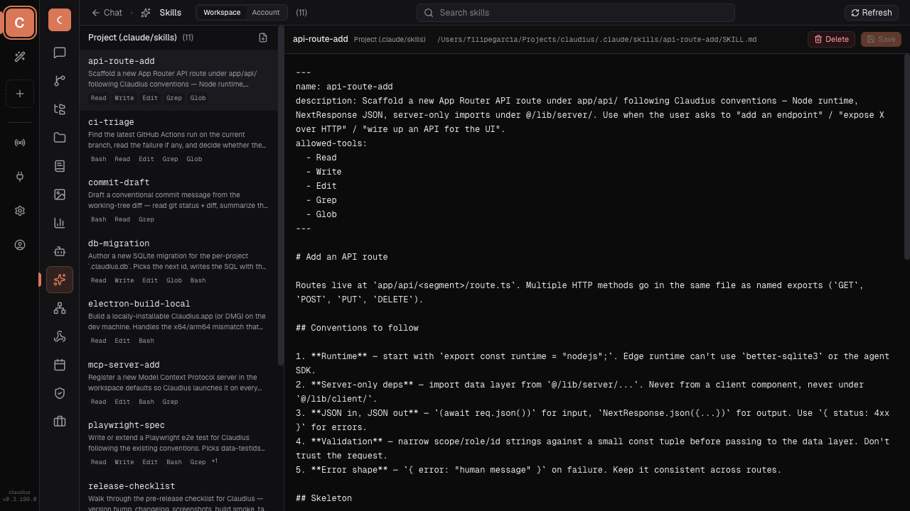

**`/skills`** holds short, opinionated playbooks scoped to a project. They're just markdown with a YAML front-matter trigger — Claude picks them up when a relevant request comes in. Great for "always do X this way in this repo" without rewriting your system prompt.

### Hooks

**`/hooks`** runs shell commands at lifecycle events — `PreToolUse`, `PostToolUse`, `SessionStart`, `SessionEnd`, `Stop`, etc. Use them for guardrails (block writes outside the repo), notifications (Slack ping when a job finishes), or automation (re-run the formatter after every edit).

### Schedule

Cron without leaving the browser. At **`/schedule`**, define a routine: a prompt or slash command, a cron expression, the workspace it runs in. Claudius wakes up, runs the agent, files the result. Good for daily standups, deploy checks, log triage. One-time runs ("remind me to look at this at 3pm tomorrow") work too.

### Cost & usage

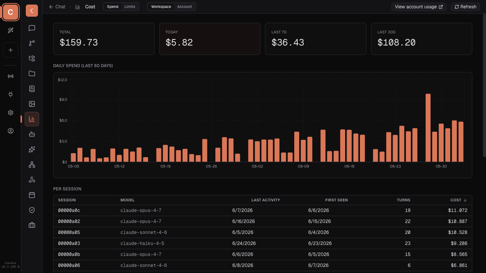

**`/cost`** breaks down spend per session, per model, per day. Set warnings, spot which sub-agent is burning your budget, and export raw events for your own dashboards.

### Git & files

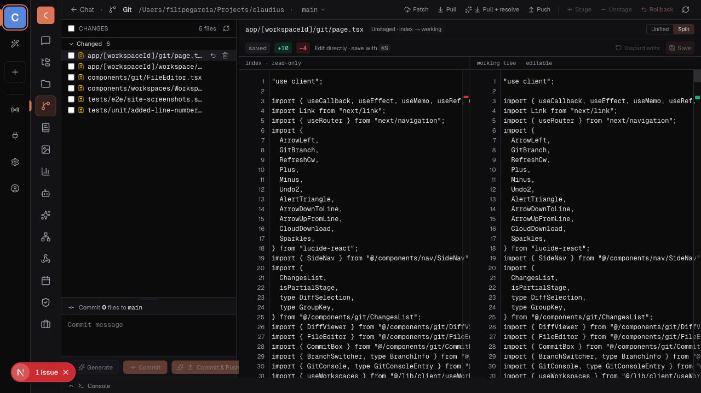

**`/git`** stages, diffs, commits — no shelling out. Stuck on a commit message? Hit "Draft" and Claude writes one from the diff.

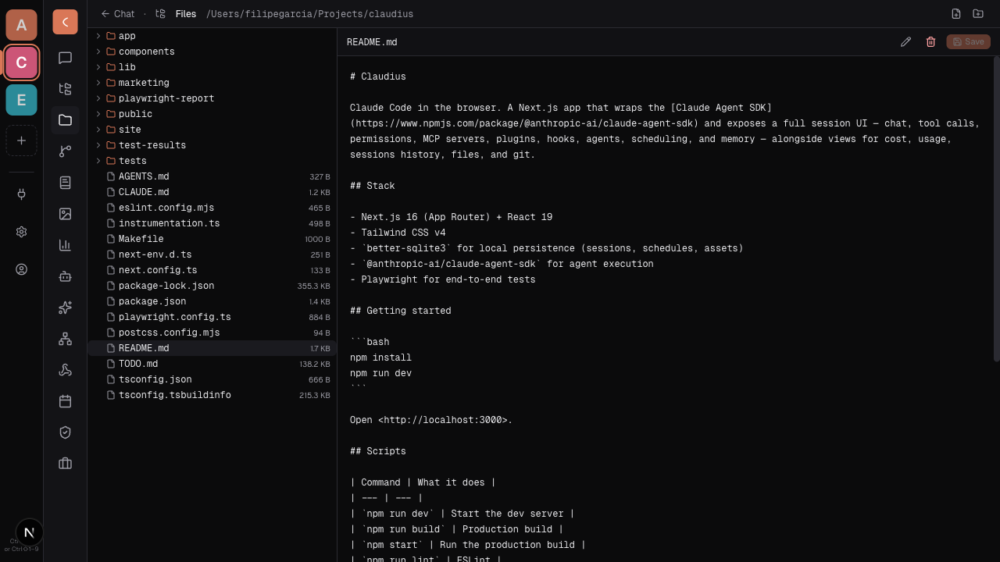

**`/files`** browses the project the agent is working in, with quick previews.

### Memory

Notes that persist across sessions, scoped per project or per user. Claude can read and write them, so "the user prefers tabs" or "the deploy script is at scripts/deploy.sh" sticks without re-explaining every conversation.

### Community

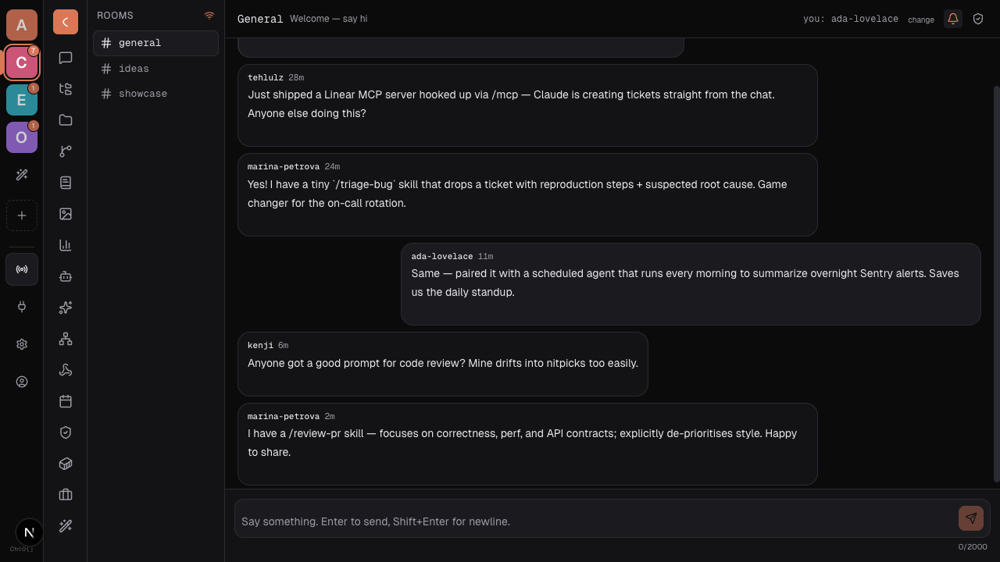

A shared room for everyone running Claudius — ask, share what you built, get notified when someone replies. Bring your own server; institutions can self-host and point Claudius at it.

### Self-update

Claudius checks upstream for new commits on **boot** (a few seconds after the server is up) and **once a day** while it's running. What happens when something new is found depends on the mode set at **`/updater`**:

| Mode | Background behaviour |
| --- | --- |
| **Auto + Claude merge** *(default)* | Auto-pull. If the working tree is clean and the update is a fast-forward, just `git pull --ff-only` + `bun install` + `bun run build` + restart. If the tree is dirty (e.g. you have a published customization), spawn a Claude Code session with shell + file tools to resolve the merge before rebuilding. Costs API credits when conflicts trigger. |
| **Auto, fast-forward only** | Auto-apply only the clean fast-forward case. Dirty trees and divergent branches surface a banner with an "Apply" button — nothing happens without your click. |
| **Notify only** | Background check still runs; banner shows. Never auto-applies. |
| **Disabled** | No checks at all. |

The banner at the top of every page surfaces pending updates and in-progress runs. Manual "Check now" / "Apply" / "Apply with Claude merge" buttons live on **`/updater`** regardless of mode.

**Restart behaviour.** When running via `make up` / `bin/claudiusd up` (the production daemon), the updater spawns a detached child that waits for the current process to exit, then re-runs `bin/claudiusd up`. You'll see the connection drop briefly and reconnect on the new build. When running via `bun run dev` / the `claudius` launcher (foreground terminal), the updater applies the changes but won't kill your tty — Ctrl-C and re-run `claudius` to pick up the new build.

**Customizations + auto-update.** This is the use-case the Claude-merge mode is designed for: you've published one or more customizations (which means the source tree has your edits in it, not just upstream's), and you want upstream bug fixes without losing them. Each Claude merge run is bounded (~10 min, no MCP, no sub-agents, no network beyond `git`) and writes a transcript to `.claudius/logs/updater.log`. If anything fails (merge conflicts unresolved, build fails) the apply aborts cleanly and the previous build keeps serving. Settings live at `~/.claude/.claudius/updater.json`.

### Customize — edit Claudius from inside Claudius

This is the one that surprises people. Hit **New customization** and Claudius mirrors its own source into a private folder, opens a workspace pointing there, and spawns a preview on a separate port. Chat with the agent like normal — *it edits the mirror, not the running app*. When you're happy, hit **Publish**. If something breaks, **Revert** — or run `make claudius-revert` from a terminal if the UI itself is broken.

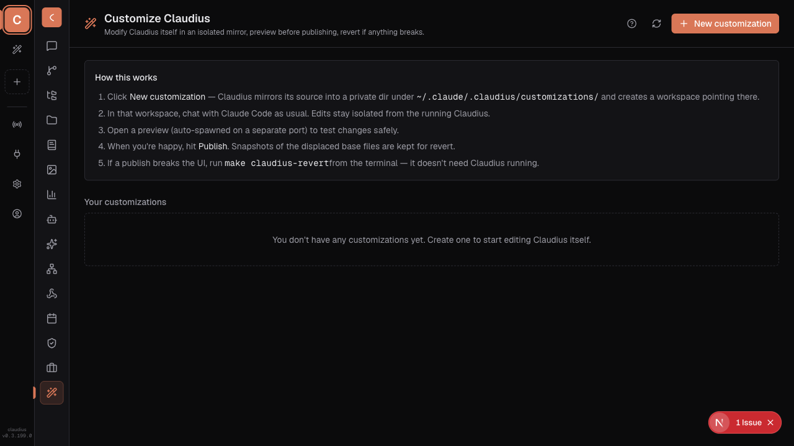

One page lists every customization you've started. Toggle one on, open its workspace, or wipe it — snapshots make every publish reversible.

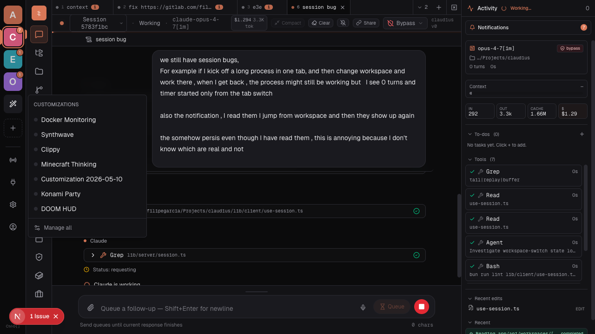

All your customizations collapse into one wand tile in the rail, with a count badge. Click it and the most-recently-opened ones spill out — chat history and sessions stay scoped to each.

Every publish takes byte-level snapshots indexed in a plain JSON manifest under `~/.claude/.claudius/customizations/`. The revert CLI has zero runtime dependencies, so it works even when Claudius itself won't boot.

#### Nine demos, one afternoon

People have built all of these by just asking the agent. Each lives in its own mirror — toggle on, toggle off, independent of the others.

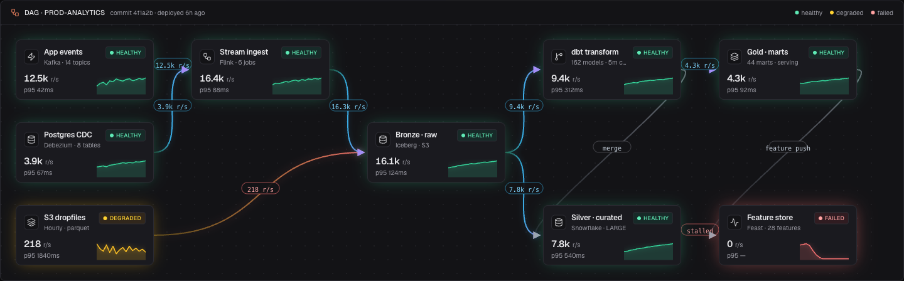

A new `/pipeline` route with full DAG observability — nine stages from Kafka to a Feature store, gradient-curve edges with throughput labels, per-node sparklines, p95 latency, and a run-history strip showing the last 24 runs as green/amber/red chips.

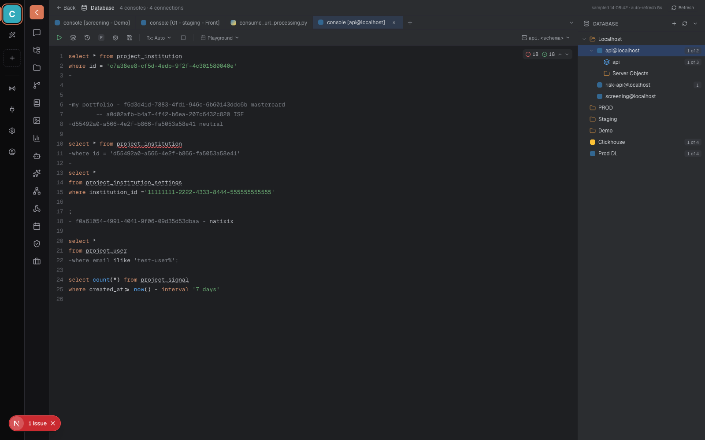

A new `/database` route — a JetBrains-DataGrip-style SQL console without the JetBrains. Multi-tab editor, real SQL syntax highlighting, error/warning gutter, and a tree of every Postgres + Clickhouse connection. Stop alt-tabbing.

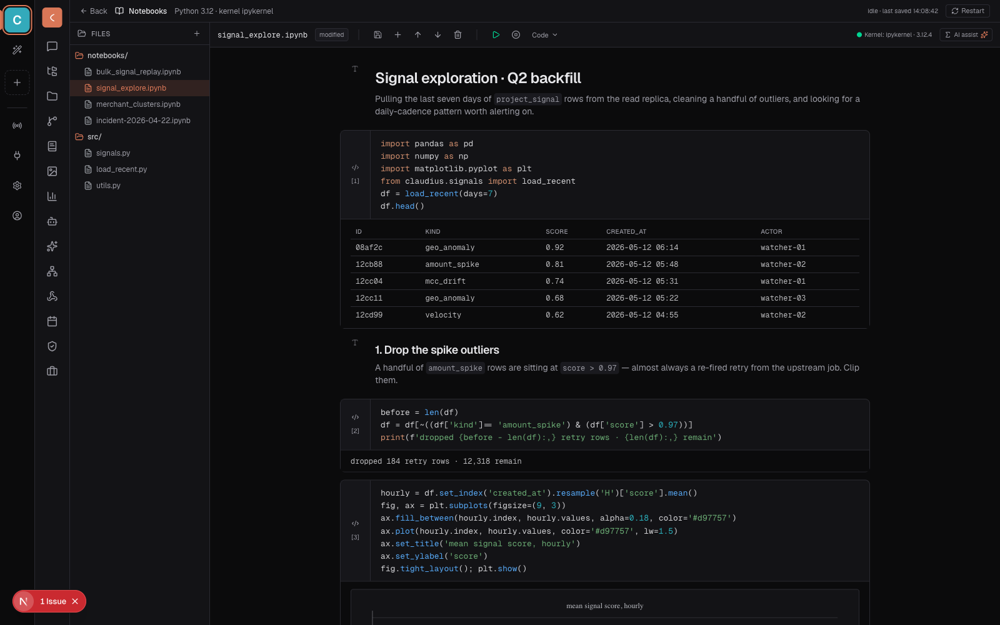

A new `/notebooks` route — run `.ipynb` files right in Claudius. Code cells with Python syntax highlighting, pandas tables, matplotlib plots, a running-cell indicator, kernel status, and an AI-assist pill so the agent can rewrite the cell you're stuck on without leaving the workbench.

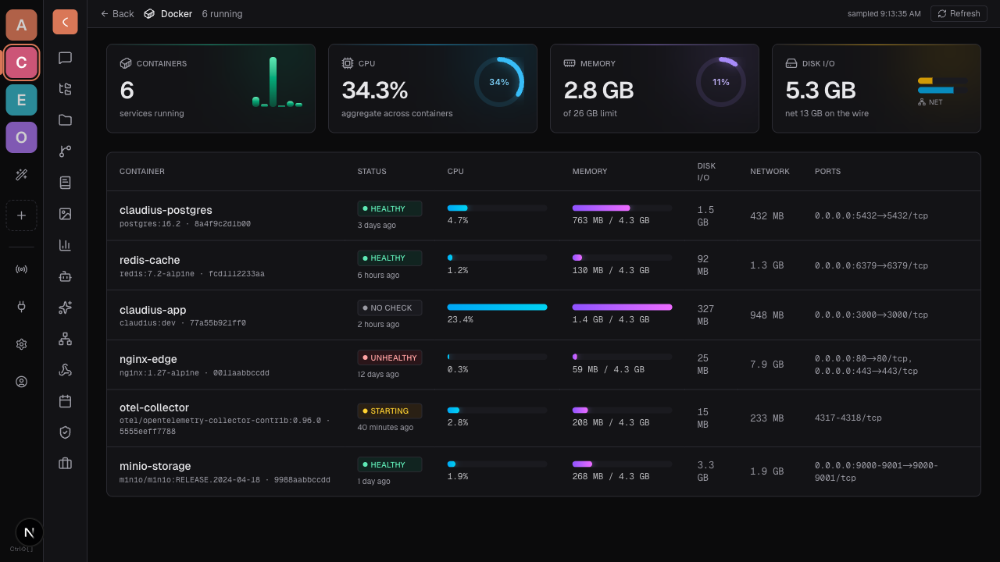

A `/docker` route that polls `docker ps` + `docker stats` every five seconds. Aggregate cards, per-container CPU/MEM gradient bars, healthy/unhealthy/starting badges.

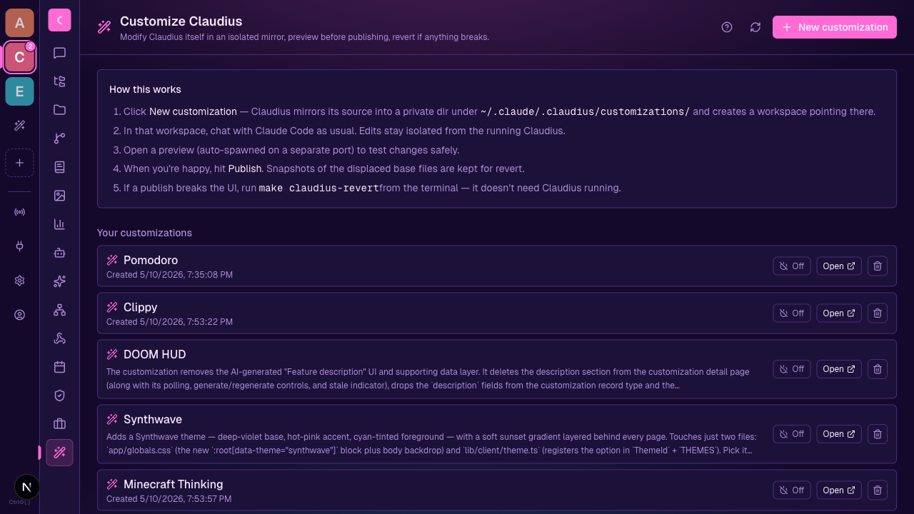

Two-file repaint — `app/globals.css` + `lib/client/theme.ts`. Hot-pink accent, deep-violet panels, sunset gradient behind the whole UI.

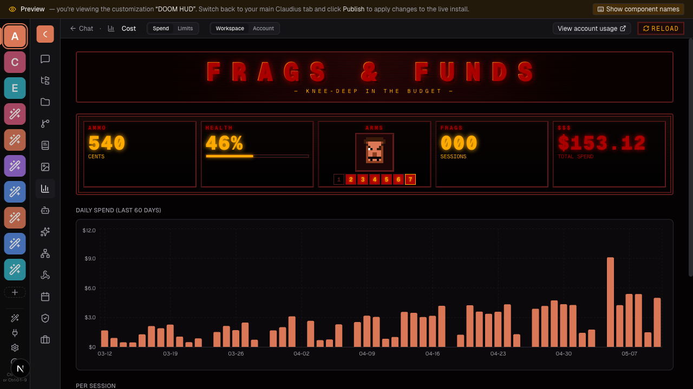

The Cost page becomes a 1993 DOOM HUD. Tokens are ammo, budget is health, the pixel face bloodies up as the day's spend climbs.

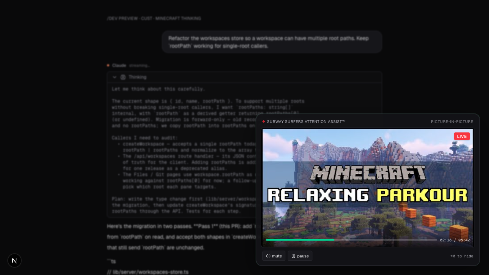

Edits the `ThinkingBlock` so Claude's reasoning streams next to a live Minecraft parkour clip — complete with mute and pause. Subway-Surfers attention assist™.

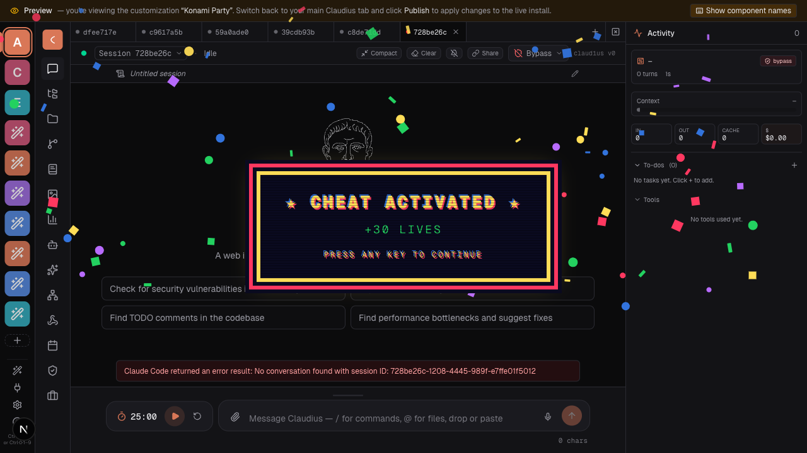

↑ ↑ ↓ ↓ ← → ← → B A — chunky 8-bit banner, eighty confetti particles, four seconds of nonsense. Worth it.

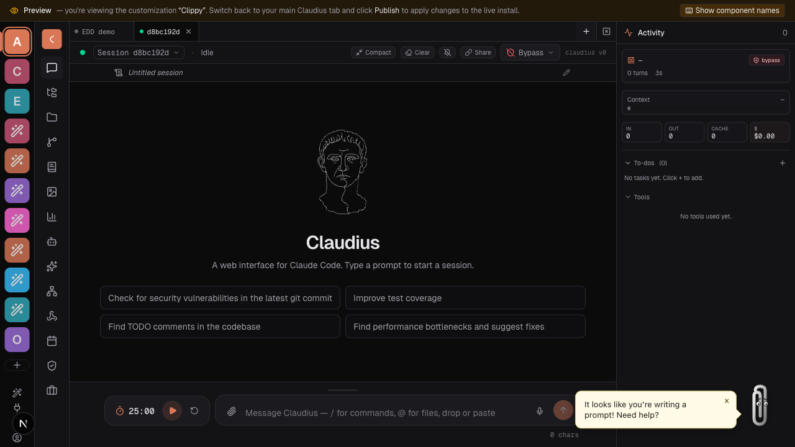

A paperclip mascot with route-aware speech bubbles. "It looks like you're writing a prompt!" Yes. Yes it does.

---

## Electron

Claudius runs as a plain web app **and** as a native desktop app (Electron). The
same Next.js renderer powers both; the desktop build adds a native menu, custom
title bar, OS notifications, deep links, and an auto-updater.

### The `isElectron()` flag — branch behavior once, everywhere

When a feature needs to behave differently on desktop vs. web, branch on the one
canonical flag:

```ts
import { isElectron } from "@/lib/shared/runtime";

if (isElectron()) {
  // desktop-only path (native dialog, menu accelerator, …)
} else {
  // web path
}
```

`isElectron()` works in **both realms** by reading whichever signal exists:

| Realm | Signal | Set by |
| --- | --- | --- |
| Renderer / browser | `window.claudius?.isElectron` | the preload bridge (`electron/preload.ts`) |
| Server / Node | `process.env.CLAUDIUS_ELECTRON === "1"` | the main process (`electron/main.ts`) |

A plain browser tab and a standalone `next dev` / `next start` both report
`false` — that's the web build.

Two rules of thumb:

- **Inside React components, use the `useIsElectron()` hook**
  (`lib/client/useElectron.ts`) instead — it's SSR-safe and re-renders when the
  bridge resolves, so it won't cause a hydration mismatch. Everywhere else
  (event handlers, utilities, server code), call `isElectron()`.
- **Server-side detection is packaged-only.** In `electron:dev` the renderer
  points at a separate `next dev` process that doesn't inherit
  `CLAUDIUS_ELECTRON`, so `isElectron()` is `true` in the renderer but `false`
  on the dev server. In the packaged build the Next server runs *inside* the
  Electron main process, so both agree.

To call a native affordance directly (with a web fallback), reach for the typed
bridge instead — `useClaudius()` returns `window.claudius` (or `null` on web);
the full contract lives in `lib/shared/electron.d.ts`.

### Running the desktop build

| Command | What it does |
| --- | --- |
| `bun run electron:dev` | Rebuild the native module for Electron, compile `electron/`, then run `next dev` + Electron |
| `bun run electron:build` | Production Next build + compile `electron/` |
| `bun run electron:dist` | Build signed/packaged artifacts (mac/win/linux) via electron-builder |

> **Native-module ABI mode-lock.** `better-sqlite3` is a native module; its
> compiled binary can't be loaded by both plain Node and Electron at once.
> `electron:dev` rebuilds it for Electron; run `bun run
> electron:rebuild-native-for-node` to switch back before `bun run dev` /
> `bun run test`. `scripts/native-abi.mjs` records the current side and warns
> on mismatch.

### macOS auto-update is gated on code signing — revisit when we sign builds

> **⚠️ When we add Apple Developer ID code signing + notarization, come back to
> this.** macOS auto-update (Squirrel.Mac / `ShipIt`) validates that the
> downloaded update satisfies the *installed* app's designated code requirement.
> Our public release pipeline currently **ad-hoc signs** the macOS bundle
> (certless — `codesign --sign -` in `build/after-pack.js`, with
> `-c.mac.notarize=false` in `.github/workflows/release.yml`). Ad-hoc signatures
> have no Team ID anchor, so no two builds satisfy each other's requirement and
> every in-place swap is rejected post-quit with *"code failed to satisfy
> specified code requirement(s)"* — stranding the user on a half-applied update.
>
> Because of that, `electron/ipc/updater.ts` **disables the in-place self-update
> on macOS unless the running app is Developer ID signed** (runtime `codesign`
> probe — `isDeveloperIdSigned` / `autoUpdateIsSafe`). Unsigned mac builds skip
> the download entirely and surface a "Download update" banner that points at the
> GitHub Releases DMG instead.
>
> The gate is runtime, not build-time, so once real signing + notarization land
> (wire the `CSC_*` / `APPLE_*` secrets into the two mac release jobs and drop the
> `notarize=false` / `CSC_IDENTITY_AUTO_DISCOVERY=false` overrides), auto-update
> re-enables itself with no code change. At that point, **revisit this**: confirm
> the in-place swap actually works end-to-end on a signed build, and consider
> retiring the `manual-download` status + banner if it's no longer reachable.

## Dev commands

| Command | What it does |
| --- | --- |
| `bun run dev` | Dev server on `:3000` |
| `bun run lint` | ESLint (scope by passing file paths) |
| `bun run test:e2e` | Playwright |
| `make documentation` | Generate/refresh [`docs/SITEMAP.md`](docs/SITEMAP.md) — the interface map |

See `AGENTS.md` and `CLAUDE.md` for codebase conventions before contributing.

### Interface map

[`docs/SITEMAP.md`](docs/SITEMAP.md) catalogs every UI screen, navigation menu, and HTTP endpoint, with a short description of each. Run `make documentation` to (re)generate it: the route structure is discovered from `app/**`, and per-interface descriptions are written by Claude (via the bundled agent SDK — uses your existing Claude Code login, no API key) and cached in `docs/.sitemap-cache.json`, so re-runs only re-describe the screens whose source changed. Use `make documentation NO_AI=1` for a structure-only pass with no Claude calls, or `FORCE=1` to regenerate everything.

---

## License & trademarks

Claudius is released under the [MIT License](./LICENSE) — use it, modify it, fork it, ship it, just keep the copyright notice.

**Claude®**, **Claude Code®**, and the **Claude Agent SDK** are trademarks of Anthropic, PBC. References here are descriptive ([nominative fair use](https://en.wikipedia.org/wiki/Nominative_use)) — the same way a project might say "for Node.js" or "works with PostgreSQL." See [TRADEMARKS.md](./TRADEMARKS.md) for the full notice.
